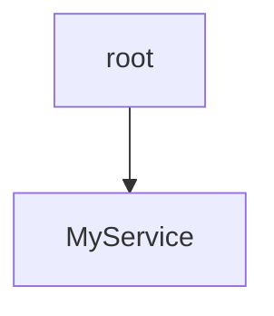
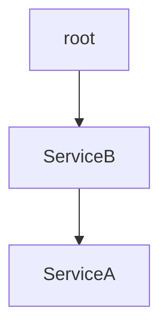

# How It Works

This document describes exactly how @joist/di is implemented.

At the root there is a single injector.

```ts
const app = new Injector();
```

Services are created by decorating classes with @injectable.

```ts
@injectable
class MyService {}
```

This creates a local injector for every instance of this particular service. All service injectors are tracked in a map called INJECTABLE_MAP.

If we were construct an instance of this service we would find a single injector insntance in INJECTABLE_MAP.

```ts
const instance = app.inject(MyService);

INJECTABLE_MAP.get(instance) // Injector;
```

When an Injector calls `.inject()`, it assigns itself as the parent of the created service.

```ts
const instance = app.inject(MyService);

assert.equal(app, INJECTABLE_MAP.get(instance)!.parent)
```

This means that any providers that are defined in the parent injector will be used when constructing services from it.

Our graph would now look like this.


Since services can have other services injected into them and since each injectable service creates its own instance injector, that injector will be used when creating services to be injected into it.

```ts
const app = new Injector();

@injectable
class ServiceA {}

@injectable
class ServiceB {
  a = inject(ServiceA);
}

const instance = app.inject(ServiceB);

instance.a(); // ServiceA
```
ServiceB is constructed from the root injector. 
The root injector is added as a parent of the ServiceB instance injector.
ServiceB injects ServiceA using the ServiceB injector. Since no override has been found it flows up to the root injector.


This is one of the core concepts when understanding how this injector works. 
When creating an instance of a service the injector will always defer to its parent unless it has found an override.
