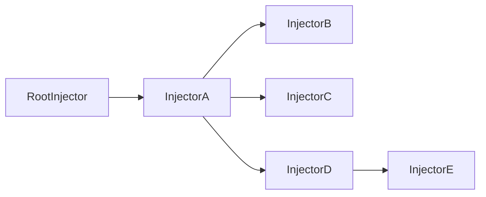

# Di

Dependency Injection in ~800 bytes.

Allows you to inject services into other class instances (including custom elements and node).

#### Installation:

```BASH
npm i @joist/di
```

#### Example:

Classes that are decoratored with `@injectable` can use the `inject()` function to inject a class instance.

Different implementations can be provided for services.

```TS
import { Injector, injectable, inject } from '@joist/di';

class Engine {
  type: 'gas' | 'electric' = 'gas';

  accelerate() {
    return 'vroom';
  }
}

class Tires {
  size = 16;
}

@injectable
class Car {
  engine = inject(Engine);
  tires = inject(Tires);

  accelerate() {
    // the inject function returns a function
    // this means that services are not initalized until they are called
    return this.engine().accelerate();
  }
}

const factory1 = new Injector();
const car1 = factory1.get(Car);

// vroom, 16
console.log(car1.accelerate(), car1.tires().size);

const factory2 = new Injector([
  {
    provide: Engine,
    use: class extends Engine {
      type = 'electric';

      accelerate() {
        return 'hmmmmmmmm';
      }
    }
  },
  {
    provide: Tires,
    use: class extends Tires {
      size = 20;
    }
  }
]);

const car2 = factory2.get(Car);

//hmmmmmmmm, 20
console.log(car2.accelerate(), car2.tires().size);
```

#### Factories

In addition to defining providers with classes you can also use factory functions.

```ts
class Logger {
  log(..._: any[]): void {};
}

const app = new Injector([
  {
    provide: Logger,
    factory() {
      return console;
    }
  }
]);
```

#### Testing

Dependency injection can make testing easy without requiring test framework level mock.

```TS
import { Injector, injectable, inject } from '@joist/di';

@injectable
class HttpService {
  fetch(url: string, init?: RequestInit) {
    return fetch(url, init);
  }
}

class ApiService {
  #http = inject(HttpService);

  getData() {
    return this.#http()
      .fetch('/api/v1/users')
      .then((res) => res.json());
  }
}

// unit test
const testApp = new Injector([
  {
    provide: HttpService,
    use: class extends HttpService {
      async fetch() {
        // return whatever response we like
        return Response.json({ fname: 'Danny', lname: 'Blue' });
      }
    },
  },
]);

// our test instance will be using our mock when making http requests
const api = testApp.get(ApiService);
```

### Parent/Child relationship

Injectors can be defined with a parent element. The top most parent will (by default) be where services are constructed and cached. Only if manually defined providers are found earlier in the chain will services be constructed lower. The injector resolution algorithm behaves as following.

1. Do I have a cached instance locally?
2. Do I have a local provider definition for the token?
3. Do I have a parent? Check parent for 1 and 2
4. All clear, go ahead and construct and cache the requested service


In the above tree, if InjectorE requests a service, it will navigate up to the RootInjector and cache.
If Inject B then requests the same token, it will recieve the same cached instance from RootInjector.


#### Custom Elements:

Joist is built to work with custom elements. Since the document is a tree we can search up that tree for providers.

```TS
import { injectable, inject } from '@joist/di';

class Colors {
  primary = 'red';
  secodnary = 'green';
}

@injectable
class ColorCtx extends HTMLElement {
  // services can be scoped to a particular injectable
  static providers = [
    {
      provide: Colors,
      use: class implements Colors {
        primary = 'orange';
        secondary = 'purple';
      },
    },
  ]
}

@injectable
class MyElement extends HTMLElement {
  #colors = inject(Colors);

  connectedCallback() {
    const { primary } = this.#colors();

    this.style.background = primary;
  }
}

// Note: To use parent providers, the parent elements need to be defined first in correct order!
customElements.define('color-ctx', ColorCtx);
customElements.define('my-element', MyElement);
```

```HTML
<!-- Default Colors -->
<my-element></my-element>

<!-- Special color ctx -->
<color-ctx>
  <my-element></my-element>
</color-ctx>
```

#### Environment

When using @joist/di with custom elements a default root injector is created dubbed 'environment'. This is the injector that all other injectors will eventually stop at.
If you need to define something in this environment you can do so with the `defineEnvironment` method.

```ts
import { defineEnvironment } from '@joist/di';

defineEnvironment([{ provide: MyService, use: SomeOtherService }]);
```

#### No decorators no problem:

While this library is built with decorators in mind it is designed so that it can be used without them.

```TS
import { Injector, injectable, inject } from '@joist/di';

class Engine {
  type: 'gas' | 'electric' = 'gas';
}

class Tires {
  size = 16;
}

const Car = injectable(
  class {
    engine = inject(Engine);
    tires = inject(Tires);
  }
);

const app = new Injector();
const car = app.get(Car);

// gas, 16
console.log(car.engine(), car.tires());
```
