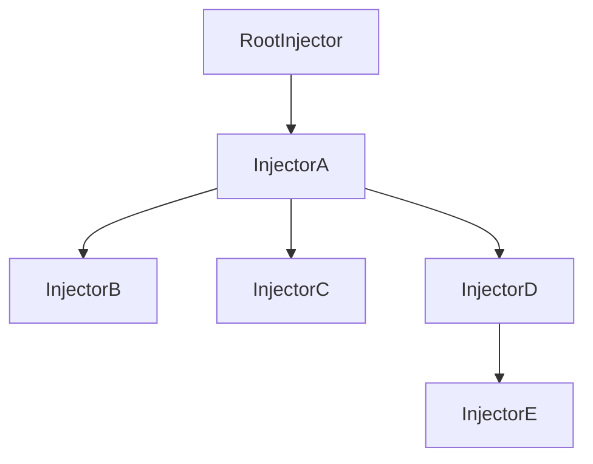

# Di

Small and efficient dependency injection.

Allows you to inject services into other class instances (including custom elements and Node.js).

## Table of Contents

- [Installation](#installation)
- [Injectors](#injectors)
- [Services](#services)
- [Injectable Services](#injectable-services)
- [Defining Providers](#defining-providers)
- [StaticTokens](#statictokens)
- [LifeCycle](#lifecycle)
- [Hierarchical Injectors](#hierarchical-injectors)
- [Custom Elements](#custom-elements)

## Installation

```bash
npm i @joist/di
```

## Injectors

Injectors are the core of the dependency injection system. They:
- Create and manage service instances
- Handle dependency resolution
- Maintain a hierarchy of injectors
- Cache service instances

## Services

At their simplest, services are classes. Services can be constructed via an `Injector` and treated as singletons (the same instance is returned for each call to `Injector.inject()`).

```ts
const app = new Injector();

class Counter {
  value = 0;

  inc(val: number) {
    this.value += val;
  }
}

// These two calls will return the same instance
const foo = app.inject(Counter);
const bar = app.inject(Counter);

console.log(foo === bar); // true
```

## Injectable Services

Singleton services are great, but the real benefit can be seen when passing instances of one service to another. Services are injected into other services using the `inject()` function. In order to use `inject()`, classes must be decorated with `@injectable`.

`inject()` returns a function that will then return an instance of the requested service. This means that services are only created when they are needed and not when the class is constructed.

```ts
@injectable()
class App {
  #counter = inject(Counter);

  update(val: number) {
    const instance = this.#counter();
    instance.inc(val);
  }
}
```

## Defining Providers

A key reason to use dependency injection is the ability to provide multiple implementations for a particular service. For example, we probably want a different HTTP client when running unit tests versus in our main application.

In the example below, we have a defined `HttpService` that wraps fetch. For our unit test, we'll use a custom implementation that returns just the data we want. This also has the benefit of avoiding test framework-specific mocks.

```ts
// services.ts
class HttpService {
  fetch(url: string, init?: RequestInit) {
    return fetch(url, init);
  }
}

@injectable()
class ApiService {
  #http = inject(HttpService);

  getData() {
    return this.#http()
      .fetch('/api/v1/users')
      .then((res) => res.json());
  }
}
```

```ts
// services.test.ts
test('should return json', async () => {
  class MockHttpService extends HttpService {
    async fetch() {
      return Response.json({ fname: 'Danny', lname: 'Blue' });
    }
  }

  const app = new Injector({
    providers: [[HttpService, { use: MockHttpService }]]
  });
  const api = app.inject(ApiService);

  const res = await api.getData();

  assert.equals(res.fname, 'Danny');
  assert.equals(res.lname, 'Blue');
});
```

### Service Level Providers

Under the hood, each service decorated with `@injectable()` creates its own injector. This means that it is possible to define providers from that level down.

The example below will use this particular instance of `Logger` as well as any other services injected into this service.

```ts
class Logger {
  log(..._: any[]): void {}
}

class ConsoleLogger implements Logger {
  log(...args: any[]) {
    console.log(...args);
  }
}

@injectable({
  providers: [[Logger, { use: ConsoleLogger }]]
})
class MyService {}
```

### Factories

In addition to defining providers with classes, you can also use factory functions. Factories allow for more flexibility in deciding exactly how a service is created. This is helpful when the instance that is provided depends on some runtime value.

```ts
class Logger {
  log(..._: any[]): void {}
}

const app = new Injector([
  {
    provide: Logger,
    factory() {
      const params = new URLSearchParams(window.location.search);

      if (params.has('debug')) {
        return console;
      }

      return new Logger(); // noop logger
    }
  }
]);
```

### Accessing the Injector in Factories

Factories provide more flexibility but sometimes will require access to the injector itself. For this reason, the factory method is passed the injector that is being used to construct the requested service.

```ts
class Logger {
  log(args: any[]): void {
    console.log(...args);
  }
}

class Feature {
  #logger;

  constructor(logger: Logger) {
    this.#logger = logger;
  }
}

const app = new Injector([
  [
    Feature,
    {
      factory(i) {
        const logger = i.inject(Logger);
        return new Feature(logger);
      }
    }
  ]
]);
```

## StaticTokens

In most cases, a token is any constructable class. There are cases where you might want to return other data types that aren't objects.

```ts
// Token that resolves to a string
const URL_TOKEN = new StaticToken<string>('app_url');

const app = new Injector([
  [
    URL_TOKEN,
    {
      factory: () => '/my-app-url/'
    }
  ]
]);
```

### Default Values

A static token can be provided a default factory function to use on creation.

```ts
const URL_TOKEN = new StaticToken('app_url', () => '/default-url/');
```

### Async Values

Static tokens can also leverage promises for cases when you need to asynchronously create your service instances.

```ts
// StaticToken<Promise<string>>
const URL_TOKEN = new StaticToken('app_url', async () => '/default-url/');

const app = new Injector();

const url: string = await app.inject(URL_TOKEN);
```

This allows you to dynamically import services:

```ts
const HttpService = new StaticToken('HTTP_SERVICE', () => {
  return import('./http.service.js').then((m) => new m.HttpService());
});

class HackerNewsService {
  #http = inject(HttpService);

  async getData() {
    const http = await this.#http();

    const url = new URL('https://hacker-news.firebaseio.com/v0/beststories.json');
    url.searchParams.set('limitToFirst', count.toString());
    url.searchParams.set('orderBy', '"$key"');

    return http.fetchJson<string[]>(url);
  }
}
```

## LifeCycle

To help provide more information to services that are being created, Joist will call several lifecycle hooks as services are created. These hooks are defined using the provided decorators so there is no risk of naming collisions.

```ts
class MyService {
  @created()
  onCreated() {
    // Called the first time a service is created (not pulled from cache)
  }

  @injected()
  onInjected() {
    // Called every time a service is returned, whether it is from cache or not
  }
}
```

## Hierarchical Injectors

Injectors can be defined with a parent. The top-most parent will (by default) be where services are constructed and cached. Only if manually defined providers are found earlier in the chain will services be constructed lower. The injector resolution algorithm behaves as follows:

1. Do I have a cached instance locally?
2. Do I have a local provider definition for the token?
3. Do I have a parent?
4. Does parent have a local instance or provider definition?
5. If parent exists but no instance found, create instance in parent.
6. If no parent, all clear, go ahead and construct and cache the requested service.

Having injectors resolve this way means that all children have access to services created by their parents.



In the above tree, if InjectorE requests a service, it will navigate up to the RootInjector and cache.
If InjectorB then requests the same token, it will receive the same cached instance from RootInjector.

On the other hand, if a provider is defined at InjectorD, then the service will be constructed and cached there.
InjectorB would be given a NEW instance created from RootInjector.
This is because InjectorB does not fall under InjectorD.
This behavior allows for services to be "scoped" within a certain branch of the tree. This is what allows for the scoped custom element behavior defined in the next section.

## Custom Elements

Joist is built to work with custom elements. Since the document is a tree, we can search up that tree for providers.

Setting your web page to work is very similar to any other JavaScript environment. There is a special `DOMInjector` class that will allow you to attach an injector to any location in the DOM, in most cases this will be document.body.

```ts
const app = new DOMInjector();

app.attach(document.body); // Anything rendered in the body will have access to this injector.

class Colors {
  primary = 'red';
  secondary = 'green';
}

@injectable()
class MyElement extends HTMLElement {
  #colors = inject(Colors);

  connectedCallback() {
    const { primary } = this.#colors();
    this.style.background = primary;
  }
}

customElements.define('my-element', MyElement);
```

### Context Elements

Context elements are where Hierarchical Injectors can really shine as they allow you to define React/Preact-esque "context" elements. 
Since custom elements are treated the same as any other class, they can define providers for their local scope. The `provideSelfAs` property will provide the current class for the tokens given.
This also makes it easy to use attributes to define values for the service.

```ts
class ColorCtx {
  primary = "red";
  secondary = "green";
}

@injectable({
  name: 'color-ctx',
  provideSelfAs: [ColorCtx]
})
class ColorCtx extends HTMLElement implements ColorCtx {
  get primary() {
    return this.getAttribute("primary") ?? "red"
  }

  get secondary() {
    return this.getAttribute("secondary") ?? "green"
  }
}

@injectable()
class MyElement extends HTMLElement {
  #colors = inject(ColorCtx);

  connectedCallback() {
    const { primary } = this.#colors();
    this.style.background = primary;
  }
}

// Note: To use parent providers, the parent elements need to be defined first!
customElements.define('color-ctx', ColorCtx);
customElements.define('my-element', MyElement);
```

```html
<!-- Default Colors -->
<my-element></my-element>

<!-- Colors come from context -->
<color-ctx primary="orange" secondary="blue">
  <my-element></my-element>
</color-ctx>
```
