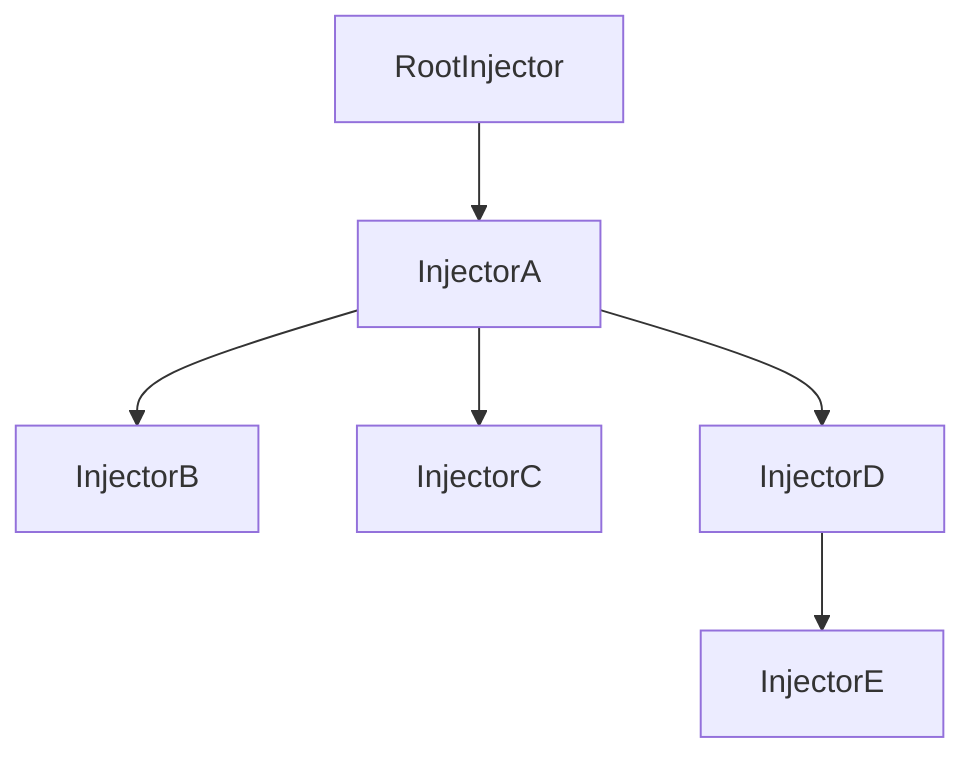

# Di

Small and efficient dependency injection for TypeScript and JavaScript applications.

Allows you to inject services into other class instances (including custom elements and Node.js).

## Benefits

- **Simple API**: Minimal boilerplate with intuitive decorators and injection
- **Type Safety**: Full TypeScript support with proper type inference
- **Hierarchical DI**: Create scoped injectors with parent-child relationships
- **Lazy Loading**: Services are only instantiated when needed
- **Testing Friendly**: Easy mocking with provider overrides
- **Web Component Support**: Built-in integration with custom elements
- **Context Pattern**: React-like context for web components
- **Lifecycle Hooks**: Fine-grained control over service initialization
- **Async Support**: Handle asynchronous service creation
- **Zero Dependencies**: Lightweight with no external dependencies

## Table of Contents

- [Di](#di)
  - [Benefits](#benefits)
  - [Table of Contents](#table-of-contents)
  - [Installation](#installation)
  - [Quick Start](#quick-start)
  - [Injectors](#injectors)
  - [Services](#services)
  - [Injectable Services](#injectable-services)
    - [Non-Singleton Injectables](#non-singleton-injectables)
    - [Injecting Multiple Providers with injectAll()](#injecting-multiple-providers-with-injectall)
  - [Defining Providers](#defining-providers)
    - [Service Level Providers](#service-level-providers)
    - [Factories](#factories)
    - [Values](#values)
    - [Accessing the Injector in Factories](#accessing-the-injector-in-factories)
  - [StaticTokens](#statictokens)
    - [Default Values](#default-values)
    - [Optional Injections](#optional-injections)
    - [Async Values](#async-values)
  - [LifeCycle](#lifecycle)
    - [Conditional Lifecycle Hooks](#conditional-lifecycle-hooks)
  - [Hierarchical Injectors](#hierarchical-injectors)
  - [Custom Elements](#custom-elements)
    - [Context Elements](#context-elements)
  - [Error Handling](#error-handling)

## Installation

```bash
npm i @joist/di
```

## Quick Start

Here's a simple example to get you started:

```ts
import { Injector, injectable, inject } from "@joist/di";

// Define a service
class Logger {
  log(message: string) {
    console.log(message);
  }
}

// Create an injectable service that depends on Logger
@injectable()
class UserService {
  #logger = inject(Logger);

  createUser(name: string) {
    const logger = this.#logger();

    logger.log(`Creating user: ${name}`);
    // ... user creation logic
  }
}

// Set up the injector
const app = new Injector();
const userService = app.inject(UserService);

// Use the service
userService.createUser("John");
```

## Injectors

Injectors are the core of the dependency injection system. They:

- Create and manage service instances
- Handle dependency resolution
- Maintain a hierarchy of injectors
- Cache service instances

## Services

At their simplest, services are classes. Services can be constructed via an `Injector` and treated as singletons (the same instance is returned for each call to `Injector.inject()`).

```ts
const app = new Injector();

class Counter {
  value = 0;

  inc(val: number) {
    this.value += val;
  }
}

// These two calls will return the same instance
const foo = app.inject(Counter);
const bar = app.inject(Counter);

console.log(foo === bar); // true
```

## Injectable Services

Singleton services are great, but the real benefit can be seen when passing instances of one service to another. Services are injected into other services using the `inject()` function. In order to use `inject()`, classes must be decorated with `@injectable`.

`inject()` returns a function that will then return an instance of the requested service. This means that services are only created when they are needed and not when the class is constructed.

```ts
@injectable()
class App {
  #counter = inject(Counter);

  update(val: number) {
    const instance = this.#counter();
    instance.inc(val);
  }
}
```

### Non-Singleton Injectables

By default, `@injectable()` classes are treated as singletons — the same instance is returned every time they are injected. If you need a new instance each time, mark the class with `service: false`.

A class decorated with `service: false` **cannot** be injected with `inject()` or `Injector.inject()` (which cache instances). Use `Injector.create()` instead, which always creates a fresh instance.

```ts
@injectable({ service: false })
class RequestContext {
  timestamp = Date.now();
}

const app = new Injector();

// Creates a new instance every time
const ctx1 = app.create(RequestContext);
const ctx2 = app.create(RequestContext);

console.log(ctx1 === ctx2); // false

// This throws — non-services cannot be cached as singletons
app.inject(RequestContext); // Error: Token RequestContext is marked as non-service...
```

You can also use the `create` helper function within an `@injectable` class to inject fresh, non-singleton instances dynamically:

```ts
import { injectable, create } from "@joist/di";

@injectable()
class App {
  // Injects a function that returns a new RequestContext instance on every call
  #ctx = create(RequestContext);

  handleRequest() {
    const context = this.#ctx();
    console.log(context.timestamp);
  }
}
```

### Injecting Multiple Providers with `injectAll()`

When you have multiple providers defined for a single token (for example, multiple plugins or configurations registered under the same `StaticToken`), you can retrieve all of them using `injectAll()`.

```ts
import { injectable, injectAll, StaticToken } from "@joist/di";

const PluginToken = new StaticToken<string>("plugin");

@injectable({
  providers: [
    [PluginToken, { value: "Plugin A" }],
    [PluginToken, { value: "Plugin B" }],
  ],
})
class App {
  #plugins = injectAll(PluginToken);

  getPlugins() {
    return this.#plugins(); // Returns ["Plugin A", "Plugin B"]
  }
}
```

## Defining Providers

A key reason to use dependency injection is the ability to provide multiple implementations for a particular service. For example, we probably want a different HTTP client when running unit tests versus in our main application.

In the example below, we have a defined `HttpService` that wraps fetch. For our unit test, we'll use a custom implementation that returns just the data we want. This also has the benefit of avoiding test framework-specific mocks.

```ts
// services.ts
class HttpService {
  fetch(url: string, init?: RequestInit) {
    return fetch(url, init);
  }
}

@injectable()
class ApiService {
  #http = inject(HttpService);

  getData() {
    return this.#http()
      .fetch("/api/v1/users")
      .then((res) => res.json());
  }
}
```

```ts
// services.test.ts
test("should return json", async () => {
  class MockHttpService extends HttpService {
    async fetch() {
      return Response.json({ fname: "Danny", lname: "Blue" });
    }
  }

  const app = new Injector({
    providers: [[HttpService, { use: MockHttpService }]],
  });
  const api = app.inject(ApiService);

  const res = await api.getData();

  assert.equals(res.fname, "Danny");
  assert.equals(res.lname, "Blue");
});
```

### Service Level Providers

Under the hood, a service decorated with `@injectable()` will create its own injector if it defines local `providers` or `provideSelfAs` in its options. This means that it is possible to define providers from that level down, while keeping the injector hierarchy flat and memory-efficient for services that do not require scoped overrides.

The example below will use this particular instance of `Logger` as well as any other services injected into this service.

```ts
class Logger {
  log(..._: any[]): void {}
}

class ConsoleLogger implements Logger {
  log(...args: any[]) {
    console.log(...args);
  }
}

@injectable({
  providers: [[Logger, { use: ConsoleLogger }]],
})
class MyService {}
```

### Factories

In addition to defining providers with classes, you can also use factory functions. Factories allow for more flexibility in deciding exactly how a service is created. This is helpful when the instance that is provided depends on some runtime value.

```ts
class Logger {
  log(..._: any[]): void {}
}

const app = new Injector({
  providers: [
    [
      Logger,
      {
        factory() {
          const params = new URLSearchParams(window.location.search);

          if (params.has("debug")) {
            return console;
          }

          return new Logger(); // noop logger
        },
      },
    ],
  ],
});
```

### Values

When you already have an instance you want to provide directly — without any construction logic — use the `value` provider. This is useful for providing primitives or pre-built objects without needing a factory or subclass.

```ts
const existingLogger = new Logger();

const app = new Injector({
  providers: [[Logger, { value: existingLogger }]],
});

assert(app.inject(Logger) === existingLogger); // true
```

This also works with `StaticToken` for injecting configuration values:

```ts
const API_URL = new StaticToken<string>("api_url");

const app = new Injector({
  providers: [[API_URL, { value: "https://api.example.com" }]],
});
```

### Accessing the Injector in Factories

Factories provide more flexibility but sometimes will require access to the injector itself. For this reason, the factory method is passed the injector that is being used to construct the requested service.

```ts
class Logger {
  log(args: any[]): void {
    console.log(...args);
  }
}

class Feature {
  #logger;

  constructor(logger: Logger) {
    this.#logger = logger;
  }
}

const app = new Injector({
  providers: [
    [
      Feature,
      {
        factory(i) {
          const logger = i.inject(Logger);
          return new Feature(logger);
        },
      },
    ],
  ],
});
```

## StaticTokens

In most cases, a token is any constructable class. There are cases where you might want to return other data types that aren't objects.

```ts
// Token that resolves to a string
const URL_TOKEN = new StaticToken<string>("app_url");

const app = new Injector({
  providers: [
    [
      URL_TOKEN,
      {
        factory: () => "/my-app-url/",
      },
    ],
  ],
});
```

### Default Values

A static token can be provided a default factory function to use on creation.

```ts
const URL_TOKEN = new StaticToken("app_url", () => "/default-url/");
```

### Optional Injections

If a default value is missing and you try to inject the token, you will get an error:

```ts
const URL_TOKEN = new StaticToken<string>("app_url");
const app = new Injector();
// !!! Throws an error !!!
const URL: string = app.inject(URL_TOKEN);
```

Sometimes, it is your intention to only inject something if it is available. In this case, you can pass the `optional` parameter to `inject`:

```ts
const URL_TOKEN = new StaticToken<string>("app_url");
const app = new Injector();
const URL: string | null = app.inject(URL_TOKEN, { optional: true });
assert(URL === null);
```

### Async Values

Static tokens can also leverage promises for cases when you need to asynchronously create your service instances.

```ts
// StaticToken<Promise<string>>
const URL_TOKEN = new StaticToken("app_url", async () => "/default-url/");

const app = new Injector();

const url: string = await app.inject(URL_TOKEN);
```

This allows you to dynamically import services:

```ts
const HttpService = new StaticToken("HTTP_SERVICE", () => {
  return import("./http.service.js").then((m) => new m.HttpService());
});

class HackerNewsService {
  #http = inject(HttpService);

  async getData() {
    const http = await this.#http();

    const url = new URL("https://hacker-news.firebaseio.com/v0/beststories.json");
    url.searchParams.set("limitToFirst", count.toString());
    url.searchParams.set("orderBy", '"$key"');

    return http.fetchJson<string[]>(url);
  }
}
```

## LifeCycle

To help provide more information to services that are being created, Joist will call several lifecycle hooks as services are created. These hooks are defined using the provided decorators so there is no risk of naming collisions.

```ts
class MyService {
  @created()
  onCreated() {
    // Called the first time a service is created (not pulled from cache)
  }

  @injected()
  onInjected() {
    // Called every time a service is returned, whether it is from cache or not
  }
}
```

### Conditional Lifecycle Hooks

You can control when lifecycle callbacks are executed by providing a condition function. The condition function receives a context object containing the current `injector` and the service `instance`:

```ts
class MyService {
  @created(({ injector }) => ({ enabled: true }))
  onCreated() {
    // This will execute because enabled is true
  }

  @injected(({ injector }) => {
    return {
      enabled: process.env.NODE_ENV === "development",
    };
  })
  onInjected() {
    // will only execute when NODE_ENV is development
  }
}
```

The condition function can return an object with an `enabled` property that determines whether the callback should execute:

- `{ enabled: true }` - The callback will execute
- `{ enabled: false }` - The callback will not execute
- `{}` - The callback will execute (default behavior)

You can use the injector to access other services or check the injector's configuration:

```ts
class MyService {
  @created(({ injector }) => {
    const config = injector.inject(ConfigService);
    return { enabled: config.featureEnabled };
  })
  onCreated() {
    // Only executes if feature is enabled in config
  }
}
```

Lifecycle conditions are useful when you need to:

- Execute callbacks only in specific environments
- Control callback execution based on injector state
- Implement feature flags for lifecycle hooks
- Conditionally initialize services based on configuration
- Make decisions based on other services in the injector

## Hierarchical Injectors

Injectors can be defined with a parent. The top-most parent will (by default) be where services are constructed and cached. Only if manually defined providers are found earlier in the chain will services be constructed lower. The injector resolution algorithm behaves as follows:

1. Do I have a cached instance locally?
2. Do I have a local provider definition for the token?
3. Do I have a parent?
4. Does parent have a local instance or provider definition?
5. If parent exists but no instance found, create instance in parent.
6. If no parent, all clear, go ahead and construct and cache the requested service.

Having injectors resolve this way means that all children have access to services created by their parents.


```mermaid
graph TD
  RootInjector --> InjectorA;
  InjectorA --> InjectorB;
  InjectorA --> InjectorC;
  InjectorA --> InjectorD;
  InjectorD --> InjectorE;
```

In the above tree, if InjectorE requests a service, it will navigate up to the RootInjector and cache.
If InjectorB then requests the same token, it will receive the same cached instance from RootInjector.

On the other hand, if a provider is defined at InjectorD, then the service will be constructed and cached there.
InjectorB would be given a NEW instance created from RootInjector.
This is because InjectorB does not fall under InjectorD.
This behavior allows for services to be "scoped" within a certain branch of the tree. This is what allows for the scoped custom element behavior defined in the next section.

## Custom Elements

Joist is built to work with custom elements. Since the document is a tree, we can search up that tree for providers.

Setting your web page to work is very similar to any other JavaScript environment. There is a special `DOMInjector` class that will allow you to attach an injector to any location in the DOM, in most cases this will be document.body.

```ts
const app = new DOMInjector();

app.attach(document.body); // Anything rendered in the body will have access to this injector.

class Colors {
  primary = "red";
  secondary = "green";
}

@injectable()
class MyElement extends HTMLElement {
  #colors = inject(Colors);

  connectedCallback() {
    const { primary } = this.#colors();
    this.style.background = primary;
  }
}

customElements.define("my-element", MyElement);
```

### Context Elements

Context elements are where Hierarchical Injectors can really shine as they allow you to define React/Preact-esque "context" elements.
Since custom elements are treated the same as any other class, they can define providers for their local scope. The `provideSelfAs` property will provide the current class for the tokens given.
This also makes it easy to use attributes to define values for the service.

```ts
class ColorCtx {
  primary = "red";
  secondary = "green";
}

@injectable({
  name: "color-ctx",
  provideSelfAs: [ColorCtx],
})
class ColorCtxElement extends HTMLElement implements ColorCtx {
  get primary() {
    return this.getAttribute("primary") ?? "red";
  }

  get secondary() {
    return this.getAttribute("secondary") ?? "green";
  }
}

@injectable()
class MyElement extends HTMLElement {
  #colors = inject(ColorCtx);

  connectedCallback() {
    const { primary } = this.#colors();
    this.style.background = primary;
  }
}

// Note: To use parent providers, the parent elements need to be defined first!
customElements.define("color-ctx", ColorCtxElement);
customElements.define("my-element", MyElement);
```

```html
<!-- Default Colors -->
<my-element></my-element>

<!-- Colors come from context -->
<color-ctx primary="orange" secondary="blue">
  <my-element></my-element>
</color-ctx>
```

## Error Handling

Common errors and how to handle them:

1. **Constructor Injection Error**

```ts
// Incorrect: Do not inject or access dependencies inside constructors
@injectable()
class MyService {
  #logger;

  constructor() {
    this.#logger = inject(Logger); // Will throw: service is being called in the constructor
  }
}

// Correct: Define dependencies as lazy accessor properties
@injectable()
class MyService {
  #logger = inject(Logger); // Returns () => Logger

  someMethod() {
    this.#logger().log("Called successfully");
  }
}
```

2. **Missing Token Provider Error**
   If you are trying to inject a `StaticToken` that does not define a default factory, you must specify a provider for that token in your injector configuration:

```ts
// Incorrect: Will throw "Provider not found" if injected without a provider:
const CONFIG_TOKEN = new StaticToken<string>("config");

// Correct: Define a provider when creating your injector:
const app = new Injector({
  providers: [[CONFIG_TOKEN, { value: "my-config-value" }]],
});
```
